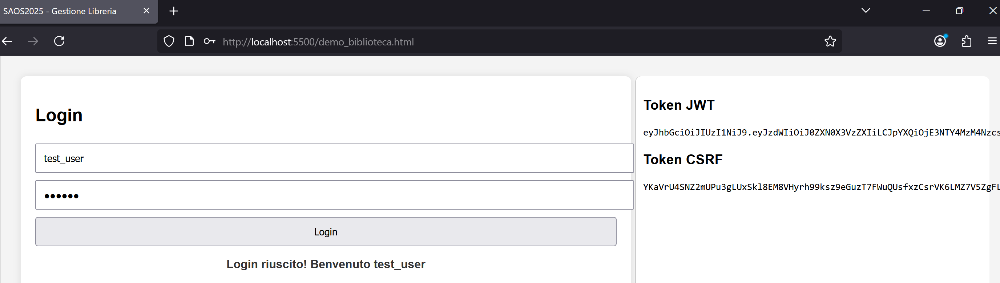
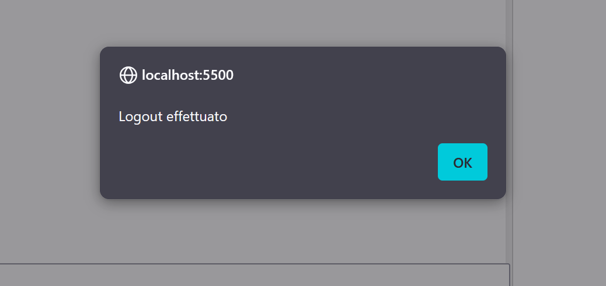
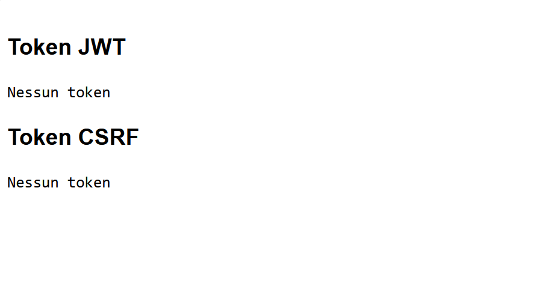
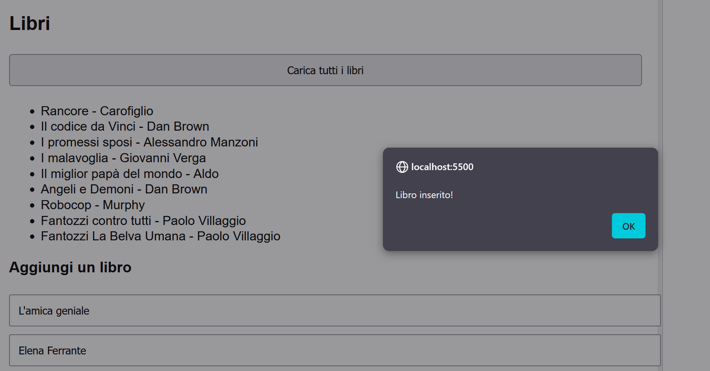
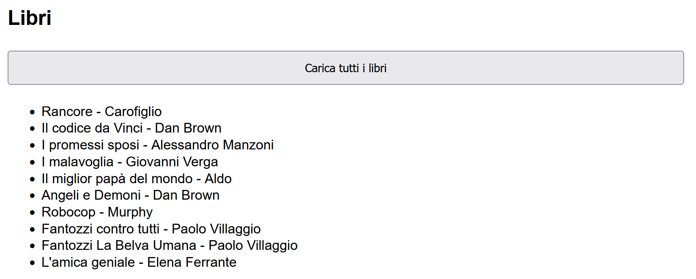
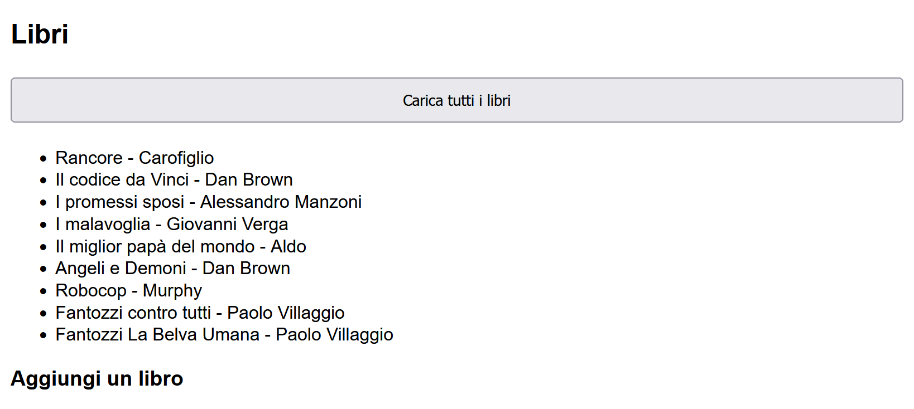
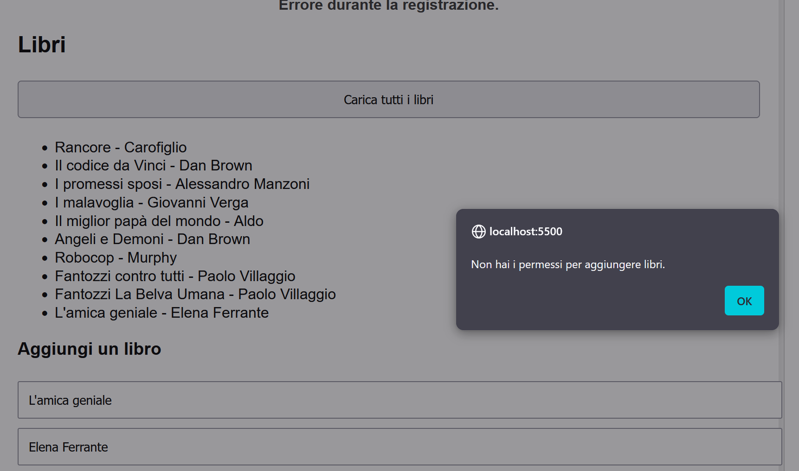
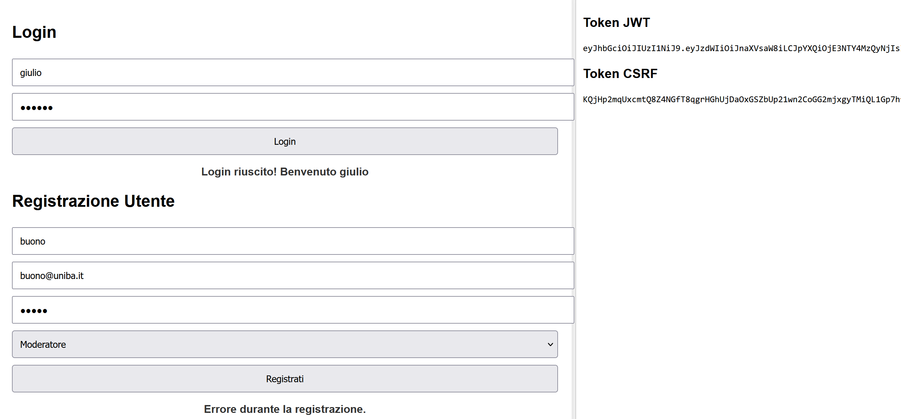
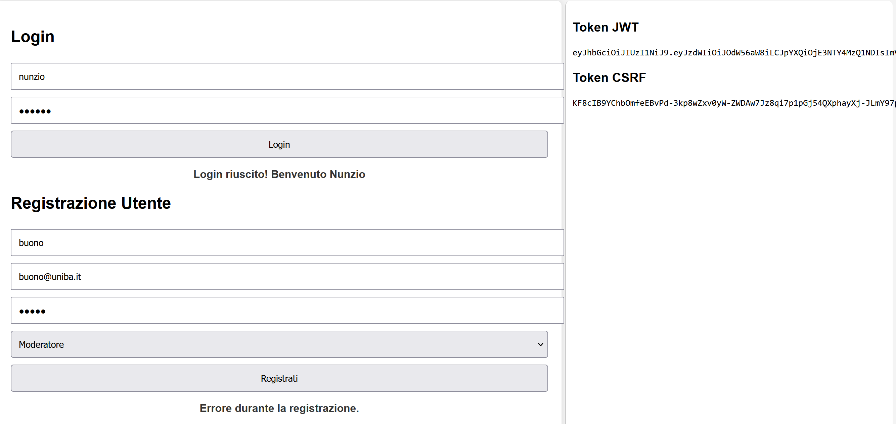
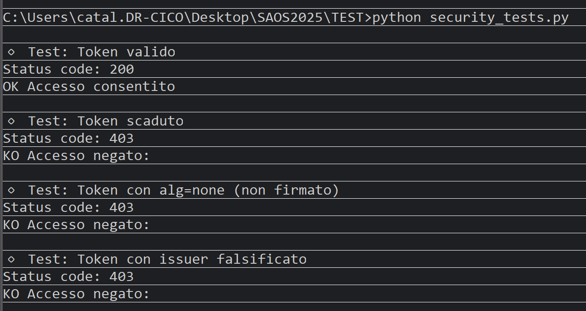

# 📚 Cataldo DAMMACCO - SAOS2025 – Sistema di Gestione Libreria con Autenticazione JWT e Protezione CSRF

## 1. Descrizione del progetto
SAOS2025 è un’applicazione sviluppata con **Spring Boot** per la gestione di una libreria online.  
Il sistema implementa un’autenticazione basata su **JSON Web Token (JWT)** con gestione dei ruoli (UTENTE, MODERATORE, ADMIN) e protezione **CSRF**.
La persistenza dei dati viene gestita con un Data Base MariaDB.  
È incluso un semplice frontend in **HTML + JavaScript** per permettere il login, la registrazione di utenti e la gestione dei libri.

---

## 2. Requisiti e installazione

### 2.1 Requisiti
- **Java 17** o superiore
- **Maven** 3.x
- **MariaDB** 10.x o superiore
- **Browser** moderno (Chrome/Firefox/Edge)
- **Editor** (IntelliJ IDEA / Eclipse / VS Code)
- **Server HTTP** (Python, Apache, NGINX)

### 2.2 Installazione
1. **Clonare il progetto**
```bash
git clone <repository_url>
cd SAOS2025
```

### 2.3 Configurare il database
1. Creare il database: `CREATE DATABASE saos;`
2. Modificare `application.properties`:
```
spring.datasource.url=jdbc:mariadb://localhost:3306/saos?useSSL=false
spring.datasource.username=root
spring.datasource.password=saos
```

### 2.4 Installare le dipendenze
```mvnw clean install```

## 3. Avviare l’applicazione
```mvnw spring-boot:run```

L’app sarà disponibile su:

```http://localhost:8080```

## 4. Aprire il frontend
1. Supponiamo di usare Python per creare un server HTTP, apriamo un terminale nella cartella dove si trovano i file HTML e diamo il comando 
`python -m http.server 5500` per avviare il server HTTP su porta 5500;
2. Aprire login.html o index.html nel browser attraverso l'url `http://localhost:5500/login.html`


## 5. Estratto da `pom.xml`:
| Libreria                                | Descrizione                     |
| --------------------------------------- | ------------------------------- |
| **spring-boot-starter-web**             | API REST                        |
| **spring-boot-starter-security**        | Autenticazione e autorizzazione |
| **spring-boot-starter-data-jpa**        | Accesso DB con JPA/Hibernate    |
| **spring-boot-starter-validation**      | Validazione dati                |
| **jjwt-api / jjwt-impl / jjwt-jackson** | JWT                             |
| **mariadb-java-client**                 | Driver MariaDB                  |
| **spring-boot-devtools**                | Hot reload in sviluppo          |

## 6. Architettura
Struttura dei package:
```
CatDam.SAOS2025
│
├── controllers        # API REST (AuthController, LibroController)
├── entities           # Entità JPA (Utente, Ruolo, Libro)
├── repositories       # DAO / repository JPA
├── security           # WebSecurityConfig, AuthTokenFilter, JwtUtils
├── payload            # DTO input (Credenziali, Registrazione)
├── response           # DTO output (JwtResponse, MessageResponse)
└── SAOS2025Application.java
```

## 7. Flusso di autenticazione JWT + CSRF
1. `GET /api/auth/csrf` : Recupera il token CSRF e un cookie di sessione.
2. `POST /api/auth/login`´ : Invia username/password con header X-XSRF-TOKEN e Restituisce un token JWT.
3. Richieste protette devono includere:
```
Authorization: Bearer <JWT>
X-XSRF-TOKEN: <CSRF token>
```

## 8. Sicurezza
- JWT per autenticazione stateless.
- CSRF Token per protezione POST/PUT/DELETE.
- Ruoli con @PreAuthorize:
    - UTENTE → può leggere libri.
    - MODERATORE → può inserire libri.
    - ADMIN → può inserire libri e registrare utenti.
- Password hash con BCrypt.

## 9. Frontend HTML
Il frontend in **HTML+JavaScript** permette:
- Login (salva JWT)
- Registrazione utente (solo ADMIN)
- Visualizzazione libri
- Inserimento libri (MODERATORE/ADMIN)
- Logout (cancella token e sessione)

## 10. Schermate
### 10.1 Login


### 10.2 Logout


### 10.3 Logout con pulizia dei token


### 10.4 Inserimento di un libro


### 10.5 libro inserito


### 10.6 Visualizzazione dei libri


### 10.7 Errore di inserimento libro per mancanza di privilegi ADMIN/MODERATORE


### 10.8 Errore di inserimento user per mancanza di privilegi ADMIN


### 10.9 Errore di inserimento user per mancanza di privilegi ADMIN


### 10.10 Esecuzione test di sicurezza con utente avente privilegi ADMIN

